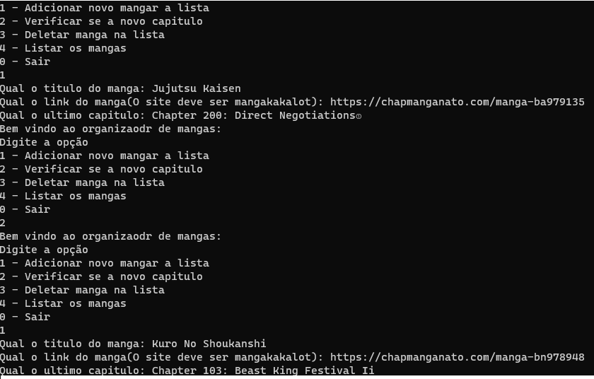
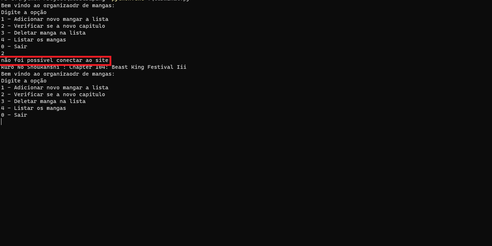
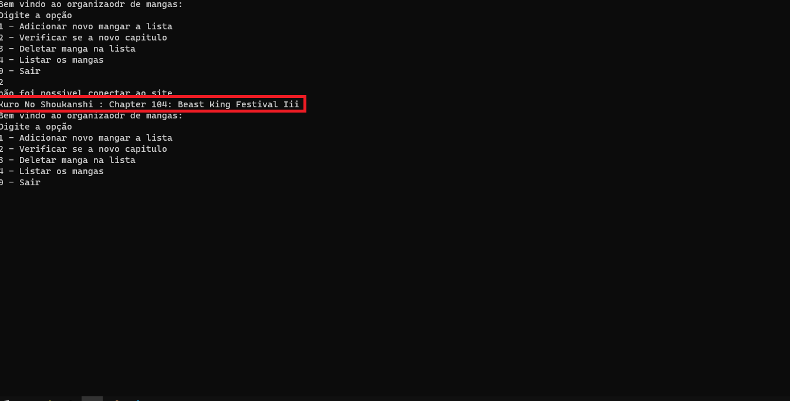

## MEU GERENCIADOR DE MANGAS

Esse e um gerenciador de mangas que criei pois como tem muitos mangas que leio que demora muito tempo
para ser lançado fica dificio lembra todos

### COMO FUCIONA

Primeior vc adiciona um manga, tem que ser do Mangakakalot pois eu configurei pensando nele

Depois quando vc quiser so verificar se a capitulo novo
###### Nesse primeiro ele deu erro pois não consegui se conectar ao site talvez por queda de internet ou algum bloqueio:

###### Ja no segundo deu certo e ele disse que esse manga tem capitulo novo:

